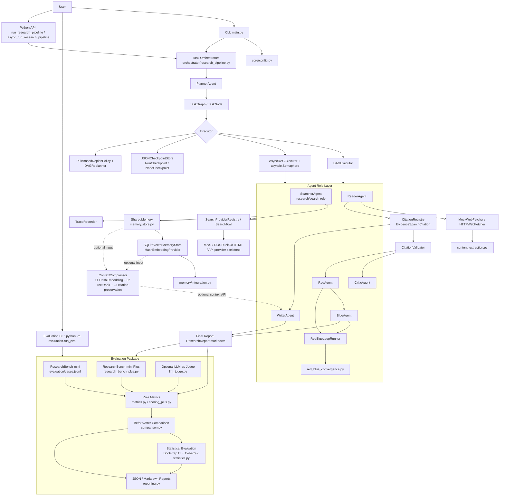
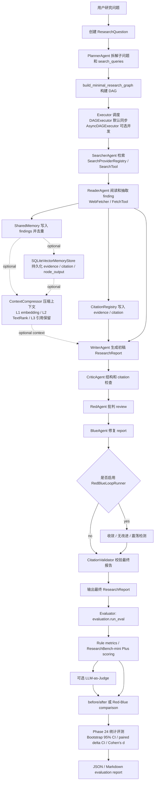

# DeepResearchAgent Final Architecture

## 一、项目最终定位

DeepResearchAgent 是一个面向复杂开放研究任务的多智能体协作系统。它通过 `PlannerAgent` 将研究问题拆解成计划和检索子问题，由 `orchestrator/research_pipeline.py` 构建研究 DAG，再由同步 `DAGExecutor` 或可选 `AsyncDAGExecutor` 调度多个 Agent 执行检索、阅读、写作、批判和修复。系统在执行过程中把计划、检索结果、证据、报告、评审和修复结果写入 `SharedMemory`，并可选持久化到本地 SQLite vector memory。最终输出带 citation grounding 校验的 `ResearchReport`，并通过 ResearchBench-mini / ResearchBench-mini Plus、可选 LLM-as-Judge、before/after comparison 和 Phase 24 bootstrap / Cohen's d 统计评测形成闭环。

当前仓库没有 FastAPI 或 HTTP API 服务；真实入口是 `main.py` CLI、`evaluation.run_eval` CLI，以及可导入的 Python 函数 `run_research_pipeline(...)` / `async_run_research_pipeline(...)`。

## 二、最终总架构图

说明：

- 仓库没有名为 `ResearchAgent` 的类；研究收集职责由 `SearcherAgent` 和 `ReaderAgent` 承担。
- 仓库没有名为 `SemanticMemory` 的类；语义/向量记忆能力由 `memory/schema.py`、`HashEmbeddingProvider` 和 `SQLiteVectorMemoryStore` 实现。
- `ContextCompressor` 已实现为独立可选 API，默认 `main.py` 主链路没有强制启用压缩。

## 三、主流程图

默认 `python main.py` 执行到 `Final`。`Eval`、`Compare` 和 `Stats` 是评测链路入口，由 `python -m evaluation.run_eval` 触发。

## 四、模块分层表

| 层级 | 模块 / 文件 | 作用 | 输入 | 输出 | 面试时一句话讲法 |
| --- | --- | --- | --- | --- | --- |
| 入口层 | `main.py` | Demo CLI，加载 env 配置，选择同步/异步 pipeline，打印报告、checkpoint、search、citation、Red-Blue 状态 | CLI 参数、环境变量、内置 `DEMO_QUESTION` | 控制台研究报告和运行元数据 | `main.py` 是项目的可演示主入口，把配置、pipeline 和输出串起来。 |
| Python API | `orchestrator/research_pipeline.py` | 构建组件、DAG handlers，并运行同步研究 pipeline | `question_text`、可选 LLM/search/fetch/checkpoint/replan/vector memory 参数 | 包含 `ResearchReport`、findings、memory、traces、citation validation 的 dict | 这是主链路的核心 API，所有 Agent 都通过它进入 DAG。 |
| Python API | `orchestrator/async_research_pipeline.py` | 使用 `AsyncDAGExecutor` 执行同一套研究组件 | 研究问题、async 并发配置、可选 checkpoint/replan 参数 | 与同步 pipeline 兼容的结果 dict | 异步入口复用主链路组件，只替换调度器。 |
| 配置层 | `core/config.py` | 从环境变量加载 LLM、search、DAG、Red-Blue、run store 配置 | 环境变量 / `.env` | `LLMConfig`、`SearchConfig`、`DAGExecutionConfig` 等 | 配置集中在一个文件，默认保持离线 deterministic。 |
| 数据模型 | `core/schema.py` | 定义研究问题、计划、搜索结果、证据、引用、报告、评审结果 | Agent 和工具产生的数据 | dataclass 契约 | 核心 schema 是 Agent 之间的稳定交接格式。 |
| LLM 支撑 | `core/llm_client.py`、`core/prompt_loader.py`、`prompts/*.md` | 可选 OpenAI-compatible LLM 调用和 prompt 加载，默认可回退 | prompt、messages、env config | LLM response 或 fallback 元数据 | LLM 是可插拔增强，不是默认测试依赖。 |
| DAG 建模 | `orchestrator/dag.py` | `TaskGraph` / `TaskNode`，校验依赖和拓扑排序 | task nodes 和依赖 | 拓扑序任务列表 | DAG 把研究流程从硬编码顺序变成显式任务图。 |
| 同步执行 | `orchestrator/executor.py` | 同步 `DAGExecutor`，按拓扑顺序执行 handler，记录状态、trace、checkpoint、replan | `TaskGraph`、handlers、checkpoint/replan 配置 | `ExecutionResult` | 同步 executor 是稳定默认路径，负责可恢复、可追踪执行。 |
| 异步执行 | `orchestrator/async_executor.py` | `AsyncDAGExecutor`，使用 `asyncio.Semaphore` 限制并发，支持 timeout、checkpoint、replan | `TaskGraph`、handlers、`max_concurrency`、timeout | `AsyncExecutionResult` | 异步 executor 为未来并行搜索/阅读提供 dependency-aware 调度。 |
| Checkpoint | `orchestrator/checkpoint.py` | JSON checkpoint store，序列化/反序列化 node output，支持 resume | `RunCheckpoint`、node output | `runs/checkpoints/*.json` | checkpoint 让已完成节点可跳过，失败或缺失节点重跑。 |
| Trace | `orchestrator/trace.py` | 记录每个 task 的状态、时间戳、错误和 metadata | task state change | trace list | trace 是 pipeline 执行过程的轻量审计日志。 |
| Dynamic Replan | `orchestrator/replan.py`、`orchestrator/dag_replanner.py` | 规则触发 replan，插入替代 search/reader 等 remedial node 或 force synthesis | failure trigger、当前 DAG、run state | mutated DAG / replan metadata | replan 是受限规则版自修复，不是复杂 LLM planner。 |
| Agent 基类 | `agents/base_agent.py` | `AgentContext` / `AgentResult` / `BaseAgent` 接口 | task input、metadata、memory、tools | 标准 AgentResult | 所有 Agent 用同一上下文和结果协议协作。 |
| Planner | `agents/planner_agent.py` | 将 `ResearchQuestion` 变成 `ResearchPlan` 和 search queries | ResearchQuestion | ResearchPlan | Planner 负责把开放问题拆成可执行检索计划。 |
| Search / Research | `agents/searcher_agent.py` | 使用 provider registry 或 search tool 检索，失败回退 mock | ResearchPlan、SearchProviderRegistry/SearchTool | `list[SearchResult]` | 仓库没有单独 ResearchAgent，检索研究职责在 SearcherAgent。 |
| Reader | `agents/reader_agent.py` | 使用 fetcher/tool 获取网页或 snippet，生成 findings，并写入 evidence/citation | SearchResult、WebFetcher/FetchTool、CitationRegistry | `list[Finding]` | Reader 把搜索结果变成可引用的结构化证据。 |
| Writer | `agents/writer_agent.py` | 生成 markdown `ResearchReport`，写 citation markers 和 References | ResearchQuestion、ResearchPlan、findings、CitationRegistry | ResearchReport | Writer 把 findings 合成为带引用的报告初稿。 |
| Critic | `agents/critic_agent.py` | 规则检查结构、引用和 citation grounding，可选 LLM notes | ResearchReport、findings、CitationRegistry | review dict | Critic 是初级质量闸门，检查报告是否完整和可引用。 |
| Red Review | `agents/red_agent.py` | 生成结构、证据、引用相关 `ReviewIssue` | report、findings、critic review | RedReviewResult | RedAgent 是对抗评审角色，主动找报告缺陷。 |
| Blue Revision | `agents/blue_agent.py` | 根据 RedReviewResult 修复报告章节、引用和 markers | report、red review、findings | BlueRevisionResult | BlueAgent 是修复角色，把可规则修复的问题落到报告里。 |
| Red-Blue Loop | `agents/red_blue_loop.py` | 多轮 Red/Blue review-revision loop，写 summary 到 SharedMemory | report、findings、critic review、loop config | RedBlueLoopResult | loop 把单轮对抗扩展成有停止条件的 bounded repair。 |
| 收敛检测 | `agents/red_blue_convergence.py` | issue fingerprint、report hash、no-improvement、oscillation、convergence score | round snapshots | convergence decision / loop summary | 这是 Red-Blue loop 的确定性停止策略。 |
| Search Provider | `search/registry.py`、`search/providers.py` | provider 注册、顺序 fallback、mock/DuckDuckGo/API skeleton search | query、provider order、max_results | normalized search response | 搜索层把真实检索和 mock fallback 包成统一接口。 |
| Web Fetch | `search/fetchers.py`、`search/content_extraction.py` | mock/http fetch，轻量 HTML title/main text extraction，失败 metadata | URL | WebFetchResult | fetch 层把网页读取和正文抽取隔离在 Reader 外部。 |
| 旧工具接口 | `tools/search_tool.py`、`tools/fetch_tool.py` | 早期 mock/simple search/fetch 工具，仍被 pipeline 兼容使用 | query 或 URL | SearchResult / PageContent | tools 保持旧接口兼容，provider/fetcher 是增强层。 |
| Citation Grounding | `tools/citation_tool.py` | `CitationRegistry`、`CitationValidator`，管理 evidence/citation 并校验 report markers | evidence text、source URL、ResearchReport | EvidenceSpan、Citation、validation dict | grounding 保证报告里的 `[C#]` 能追溯到本地证据记录。 |
| Shared Memory | `memory/store.py` | in-memory `SharedMemory`，按 type/agent 存中间产物并去重 | plan、search results、findings、report、review 等 | MemoryItem list | SharedMemory 是一次运行内 Agent 共享状态和审计记录。 |
| Vector Memory | `memory/schema.py`、`memory/vector_store.py` | `MemoryItem`、`MemorySearchResult`、SQLite vector store、cosine search | evidence/citation/summary/node_output/failure | SQLite rows / search results | 本地 vector memory 让证据和节点结果可持久化和检索。 |
| Embedding / Dedup | `memory/embeddings.py`、`memory/dedup.py` | deterministic hash embedding 和 fingerprint dedup | text、metadata | fixed-size vector / fingerprint | embedding 是离线可测替代实现，不依赖外部模型。 |
| Memory 集成 | `memory/integration.py`、`memory/persistent_store.py` | pipeline result 转 memory items；SQLite run-level persistence | pipeline result | vector memory IDs / run records | memory integration 把运行产物接到本地持久化层。 |
| Context Compression | `compression/schema.py`、`compression/compressor.py` | `EvidenceUnit`、`CompressedContext`、L1/L2/L3 压缩 | query、evidence units、memory items | compressed context with quotes/citations | compression 是可选上下文筛选层，保留引用和来源。 |
| TextRank / Token | `compression/text_rank.py`、`compression/token_counter.py` | 轻量句子 ranking 和 token 估算，无外部依赖 | query、texts | ranked sentences / token estimate | L2 TextRank 用标准库给证据句子排序。 |
| Compression 集成 | `compression/integration.py` | 从 node outputs 或 memory items 构造 EvidenceUnit，提供 writer/reviewer 压缩 API | outputs、memory_items | CompressedContext | 集成层让压缩能接 Writer/Reviewer，但默认主链路不强制启用。 |
| Mini Evaluation | `evaluation/cases.jsonl`、`evaluation/metrics.py` | ResearchBench-mini cases 和规则指标 | pipeline result | section/citation/finding/keyword/memory/red-blue scores | mini eval 是本地 deterministic smoke benchmark。 |
| Plus Benchmark | `evaluation/research_bench_plus.py`、`evaluation/scoring_plus.py` | 20 个 Plus cases、domain/difficulty、rule/composite score | ResearchBenchCase、pipeline result | case result、domain/difficulty summary | Plus benchmark 扩展覆盖领域和综合评分。 |
| LLM-as-Judge | `evaluation/llm_judge.py` | 可选 judge rubric 和 fallback judge | question、report、findings、citations | JudgeResult | judge 是可选质量视角，默认测试不调用真实 LLM。 |
| Comparison | `evaluation/comparison.py` | baseline/candidate case 对齐、delta、improved/regressed/unchanged、domain deltas | 两个 eval result JSON | EvaluationComparison | comparison 把 before/after 或 Red-Blue 开关差异变成可读摘要。 |
| Statistical Evaluation | `evaluation/statistics.py` | Bootstrap CI、paired delta CI、paired Cohen's dz | paired case scores | StatisticalComparison | Phase 24 给评测 delta 加上不确定性和效果量。 |
| Evaluation CLI / Report | `evaluation/run_eval.py`、`evaluation/reporting.py` | 运行 mini/plus eval、comparison、stats，输出 JSON/Markdown | CLI args、cases、result JSON | console summary / report files | eval CLI 是评测闭环入口，不影响主 pipeline 默认行为。 |
| 测试 | `tests/*.py` | 覆盖 Agent、DAG、checkpoint、replan、memory、compression、evaluation、statistics | unittest | pass/fail | 测试保证每个 Phase 的功能不会被后续收尾破坏。 |

## 五、接口 / 命令入口总览

| 入口 | 怎么调用 | 输入 | 输出 | 链路 |
| --- | --- | --- | --- | --- |
| Demo 主入口 | `python main.py` | `main.py` 内置 `DEMO_QUESTION`，可读取 `.env` | 控制台打印 run id、checkpoint/search/citation/Red-Blue metadata 和 markdown report | 主链路 |
| Resume Demo | `python main.py --resume <run_id>` | checkpoint run id，默认目录 `runs/checkpoints` | 复用已完成节点，输出恢复后的报告和 resume metadata | 主链路 |
| Red-Blue Loop Demo | `python main.py --red-blue-loop` | 内置 demo question，加 CLI flag 强制启用 loop | 报告、loop rounds、stop reason、convergence status、oscillation flag | 主链路 |
| Async Demo | 设置 `DEEP_RESEARCH_USE_ASYNC_DAG=1` 后运行 `python main.py` | env 配置 `DEEP_RESEARCH_DAG_MAX_CONCURRENCY`、timeout 等 | 通过 `AsyncDAGExecutor` 运行同一 demo pipeline | 主链路 |
| Python 同步 API | `from orchestrator.research_pipeline import run_research_pipeline` | `question_text` 和可选工具、checkpoint、replan、vector memory 参数 | pipeline result dict | 主链路 / library API |
| Python 异步 API | `from orchestrator.async_research_pipeline import async_run_research_pipeline` | `question_text`、并发、timeout、checkpoint/replan 参数 | pipeline result dict | 主链路 / library API |
| Mini Evaluation | `python -m evaluation.run_eval` | `evaluation/cases.jsonl` | 5 个 mini case 的 rule metric summary | 评测链路 |
| Plus Benchmark | `python -m evaluation.run_eval --bench plus` | `evaluation/research_bench_plus.py` 中的 `PLUS_CASES` | 20 case summary、domain summary、composite score | 评测链路 |
| Evaluation Report | `python -m evaluation.run_eval --bench plus --output-json evaluation/results/latest_eval.json --output-md evaluation/results/latest_eval.md` | Plus benchmark result | JSON / Markdown report 文件 | 评测链路 |
| Before/After Comparison | `python -m evaluation.run_eval --compare evaluation/results/baseline.json evaluation/results/candidate.json` | 两个已存在 eval result JSON | comparison JSON，含 deltas 和 improved/regressed/unchanged | 评测链路 |
| Statistical Evaluation | `python -m evaluation.run_eval --compare evaluation/results/baseline.json evaluation/results/candidate.json --stats` | 两个已存在 eval result JSON | comparison JSON，含 `statistical_summary`、bootstrap CI、Cohen's dz | 评测链路 |
| Red-Blue Comparison | `python -m evaluation.run_eval --bench plus --compare-red-blue` | Plus cases，自动跑 Red-Blue disabled/enabled 两组 | Red-Blue comparison summary | 评测链路 |
| Red-Blue Statistical Comparison | `python -m evaluation.run_eval --bench plus --compare-red-blue --stats` | Plus cases，自动跑两组并统计 | Red-Blue delta、paired bootstrap CI、effect size summary | 评测链路 |
| Test Command | `python -m unittest discover -s tests` | `tests/` | unittest summary | 质量验证 |

当前仓库没有 HTTP server、FastAPI app、OpenAPI route 或后台服务启动命令。

## 六、真实性边界

- 没有实现名为 `ResearchAgent` 的类；文档中用 `SearcherAgent` 和 `ReaderAgent` 表示研究收集职责。
- 没有实现名为 `SemanticMemory` 的类；文档中用 `SQLiteVectorMemoryStore` 表示本地语义/向量检索能力。
- 没有 HTTP API；只有 CLI 和 Python 函数 API。
- `ContextCompressor` 已实现并有 integration API，但没有被默认 `main.py` 主链路强制启用。
- Phase 24 statistical evaluation 只在 evaluation comparison 路径使用，不参与默认 `python main.py` 的研究报告生成。

## 七、功能冻结边界

- Phase 24 是当前项目功能终点。
- 后续不再新增 Phase 25。
- 后续只做 bug fix、README、测试清单、简历描述和面试问答。
- 当前项目已经覆盖规划、执行、记忆、证据引用、上下文压缩、对抗修复、评测、before/after comparison 和统计分析闭环。
- 当前统计分析只包含 bootstrap confidence interval、paired score delta confidence interval 和 paired Cohen's d；不包含 p-value、t-test 或复杂显著性检验。
